# Exercise Planning Timeline

> *"The exercise planning process spans from –12 months to +2 months relative to Exercise E (execution month)."*
> — Adapted from EXDESIGN Textbook, Appendix A

## Overview

The exercise planning process spans from **–12 months** to **+2 months** relative to Exercise E (execution month). This timeline provides a structured framework for planning and executing a military exercise.

---

## Five Stages of Exercise Planning

| Stage | Name | Key Activities | Milestone |
|-------|------|----------------|-----------|
| **1** | Commissioning | Identification of requirement, Commissioning Instruction issued | –12 months |
| **2** | Design and Development | Concept Development Conference (CDC) | –10 months |
| **3** | Planning | Initial Planning Conference (IPC), Main Planning Conference (MPC), Final Planning Conference (FPC) | –8 to –4 months |
| **4** | Execution/Delivery | Exercise execution | –1 to E |
| **5** | Post-Exercise Activities | After Action Review (AAR) process | +1 to +2 months |

---

## Key Conferences

| Conference | Timing | Purpose |
|------------|--------|---------|
| **Exercise Specification Meeting** | Pre-CDC | Requirement identification |
| **Concept Development Conference (CDC)** | –10 months | Exercise concept development |
| **Initial Planning Conference (IPC)** | –8 months | Initial planning |
| **Main Planning Conference (MPC)** | –6 months | Detailed planning |
| **Final Planning Conference (FPC)** | –4 months | Final preparations |

---

## Timeline Diagram

```mermaid
gantt
    title Exercise Planning Timeline (Months relative to Exercise E)
    dateFormat  X
    axisFormat %s
    
    section Stage 1: Commissioning
    Identification of Requirement       :-12, 1
    Commissioning Instruction           :-12, 1
    
    section Stage 2: Design & Development
    Concept Development Conference      :-10, 2
    Concept Development                 :-10, 2
    
    section Stage 3: Planning
    Initial Planning Conference         :-8, 1
    Main Planning Conference            :-6, 1
    Final Planning Conference           :-4, 1
    
    section Stage 4: Execution/Delivery
    Exercise                            :-1, 1
    
    section Stage 5: Post-Exercise
    After Action Review Process         :1, 1
```

---

## Checklist: Timeline Application

- [ ] Stage 1: Commissioning documented (requirement identification, CI)
- [ ] Stage 2: CDC scheduled and outputs defined
- [ ] Stage 3: IPC, MPC, FPC scheduled with milestones
- [ ] Stage 4: Exercise execution window confirmed
- [ ] Stage 5: AAR process planned
- [ ] Timeline aligned with available planning time
- [ ] All conferences linked to deliverables

---

## Cross-References

- [The Exercise Planning Process](planning.md) — The overall planning framework
- [Detailed Planning Conferences](detailed-planning.md) — Stage 3: IPC, MPC, FPC details
- [Exercise Commissioning](commissioning.md) — Stage 1: Commissioning details
- [Exercise Delivery and Execution](exercise-delivery.md) — Stage 4: Execution details
- [Post-Exercise Activities](post-exercise.md) — Stage 5: Post-exercise details

---

## Sources

[^1]: NATO AJP-3, *Allied Joint Doctrine for the Conduct of Operations*, Annex C.
[^2]: US TC 7-101, *Exercise Design*, Headquarters, Department of the Army.
[^3]: EXDESIGN Textbook, Appendix A: Exercise Planning Timeline.